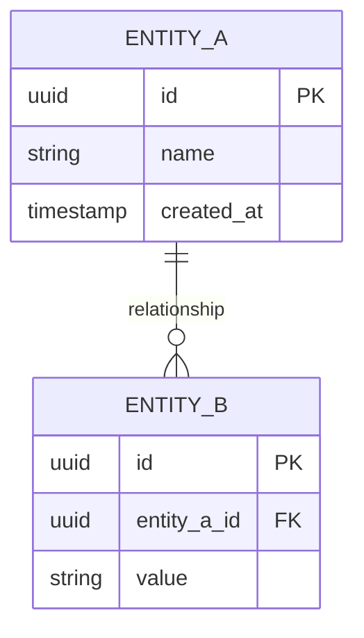

# Entity Relationship Diagram (ERD)

| Field | Value |
|-------|-------|
| **System** | [System Name] |
| **Author** | [Name] |
| **Date** | [DD Month YYYY] |

---

## 1. ER Diagram

## 2. Entity Descriptions
| Entity | Description | Key Attributes |
|--------|-------------|---------------|
| | | |

## 3. Relationship Summary
| From | To | Type | Description |
|------|----|------|-------------|
| | | 1:N / M:N / 1:1 | |

## 4. Indexes
| Table | Index Name | Columns | Type | Rationale |
|-------|-----------|---------|------|-----------|
| | | | B-tree/Hash | |
